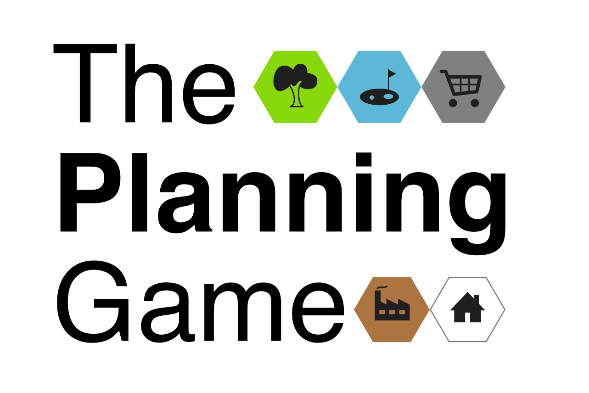

# The Planning Game

## About this game

This game was created for an away day, with the intention of connecting people to each other and learning a bit about planning.

A Fun game about Planning where players will explore

- communities & their needs
- planning complexity and trade-offs
- regional priorities

-Add Photo of people playing the game-
  
## Who is it for

Add info here

## The Format

This is a big room game that needs a minimum of X teams sitting on different tables.

It should include:

* Introduction to planning
* Introduction to the game mechanics
* Four 20-minute rounds
* Presentations
* Group voting
* Awards

## The four Rounds

### Round 1 Make Your Town (20mins)

In this round, teams will create and name their towns. 

They will learn more about the needs of their community and start to gather ideas about improving their towns

[Round 1 Rules](https://github.com/digital-land/planning-game/blob/main/Rules-round-1.md)

### Round 2 Growing Your Town. (20mins)

In this round, teams will create an Investment Plan to meet their community's needs, the development priorities they have identified, and their policies. 

[Round 2 Rules](https://github.com/digital-land/planning-game/blob/main/Rules-round-2.md)

### Round 3: New Mayor, new priorities (20mins)

A new Regional Mayor has been elected. They want to make their mark, so they have new priorities they want all towns to meet. This presents a new challenge for the teams to adapt their strategies and meet these new priorities.

[Round 3 Rules](https://github.com/digital-land/planning-game/blob/main/Rules-round-3.md)

### Round 4: Create Your Local Plan (20mins)

It’s time for teams to create a Local Plan for their town based on your previous decisions. After this round, you will present it to the rest of the room.

[Round 4 Rules](https://github.com/digital-land/planning-game/blob/main/Rules-round-4.md)

### Presentations (5 mins per team)

Each team presents their local plan to the whole room. Everyone will be expected to score based on five different categories.

## Materials and printouts needed

## Each table will need
(Don't put it all out at the same time, refer to the facilitators guide for when to hand out the different materials)

* [Rules for all 4 rounds (printable pdf)](https://github.com/digital-land/planning-game/blob/main/The%20Planning%20game%20All%20Round%20rules.pdf)
* A set of planning game tiles - TO ADD
* Planning game Town cards - TO ADD
* [Town profiles (three different towns, printable pdf](https://github.com/digital-land/planning-game/blob/main/Town%20profiles.pdf)
* [Town information and score sheet (printable pdf)](https://github.com/digital-land/planning-game/blob/main/Town%20information%20Town%20scores.pdf)
* [Town Investment plan (printable pdf)](https://github.com/digital-land/planning-game/blob/main/Investment%20plan.pdf)
* [Score Sheet (printable pdf)]([https://github.com/digital-land/planning-game/blob/main/Investment%20plan.pdf](https://github.com/digital-land/planning-game/blob/main/Score%20sheet.pdf))
* Something to represent money
* Pens to write on A4 paper
* Spare paper
* Flip charts with paper
* Flip chart pens
* Prizes

## The Planning Game Facilitation

You will need

* Someone to introduce the rounds
* At least one additional facilitator to hand out items and check on teams
* Someone to play the mayor.

Each group will get one of three different towns and corresponding tiles, cards and profiles
This game is in 4 rounds, and there are different items given out in each.

Please read the facilitator's guide carefully. ADD GUIDE LINK

---
# Licence

The software in this project is open source and covered by the [LICENSE](LICENSE) file.

Individual datasets copied into this repository may have specific copyright and licensing, otherwise all content and data in this repository is
[© Crown copyright](http://www.nationalarchives.gov.uk/information-management/re-using-public-sector-information/copyright-and-re-use/crown-copyright/)
and available under the terms of the [Open Government 3.0](https://www.nationalarchives.gov.uk/doc/open-government-licence/version/3/) licence.
