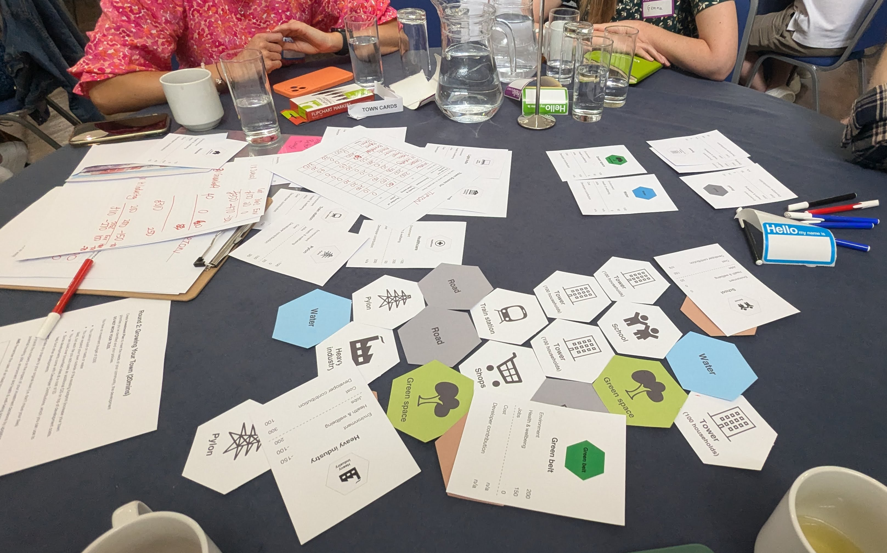

# The Planning Game

## About this game

This game was created for an away day, with the intention of connecting people to each other and learning a bit about [planning](https://en.wikipedia.org/wiki/Urban_planning).

A fun game about planning where players will explore

- communities and their needs
- planning complexity and trade-offs
- regional priorities.

  
## Who is it for

Anyone can play. You don’t need anyone with knowledge of planning but it’s fun the play it with planners.

## The format

This is a big room game that needs a minimum of 3 teams sitting on different tables.

It should include:

1. Introduction to planning
2. Introduction to the game mechanics
3. Four 20-minute rounds
4. Presentations
5. Group voting
6. Awards

## The four rounds

### Round 1: Make your town (20 mins)

In this round, teams will create and name their towns. 

They will learn more about the needs of their community and start to gather ideas about improving their towns.

[Round 1 rules](https://github.com/digital-land/planning-game/blob/main/Rules-round-1.md).

### Round 2: Growing your town (20 mins)

In this round, teams will create an investment plan to meet their community’s needs, the development priorities they have identified, and their policies. 

[Round 2 rules](https://github.com/digital-land/planning-game/blob/main/Rules-round-2.md).

### Round 3: New mayor, new priorities (20 mins)

A new regional mayor has been elected. They want to make their mark, so they have new priorities they want all towns to meet. This presents a new challenge for the teams to adapt their strategies and meet these new priorities.

[Round 3 rules](https://github.com/digital-land/planning-game/blob/main/Rules-round-3.md).

### Round 4: Create your local plan (20 mins)

It’s time for teams to create a local plan for their town based on their previous decisions. After this round, they will present it to the rest of the room.

[Round 4 rules](https://github.com/digital-land/planning-game/blob/main/Rules-round-4.md).

### Presentations (5 mins per team)

Each team presents their local plan to the whole room. Everyone will be expected to score based on five different categories.

## Materials and printouts

### Print one for each table

Most of these are A4 PDFs, apart from A5 town cards and hexagonal tiles.

* [Rules for all 4 rounds (printable PDF)](https://github.com/digital-land/planning-game/blob/main/The%20Planning%20game%20All%20Round%20rules.pdf)
* A set of 20 hexagonal planning game tiles (there are 3 different sets) [Commuter Town](https://github.com/digital-land/planning-game/blob/main/CommuterTownTiles.pdf), [Seen Better Days](https://github.com/digital-land/planning-game/blob/main/SeenBetterDaysTiles.pdf), [Inner City Life](https://github.com/digital-land/planning-game/blob/main/InnerCityLifeTiles.pdf).
* [A set of planning game Town cards (printable PDF)](https://github.com/digital-land/planning-game/blob/main/PlanningGameTownCards.pdf)
* [Town profiles (three different towns, printable PDF](https://github.com/digital-land/planning-game/blob/main/Town%20profiles.pdf)
* [Town information and score sheet (printable PDF)](https://github.com/digital-land/planning-game/blob/main/Town%20information%20Town%20scores.pdf)
* [Town investment plan (printable PDF)](https://github.com/digital-land/planning-game/blob/main/Investment%20plan.pdf)

### Print enough for each person in the room

* [Score sheet (printable PDF)](https://github.com/digital-land/planning-game/blob/main/Score%20sheet.pdf)

### Print enough for each facilitator

* [Facilitator notes](https://github.com/digital-land/planning-game/blob/main/FacilitatorNotesPlanningGame.pdf)

### Other materials needed 

* [Slides](https://github.com/digital-land/planning-game/blob/main/The%20Planning%20Game.pptx) (in PowerPoint format, can be uploaded to other software)
* Something to represent money
* Pens to write on A4 paper
* Spare paper
* Flipcharts with paper
* Flipchart pens
* Prizes

## Facilitation

You will need

* someone to introduce the rounds
* at least one additional facilitator to hand out items and check on teams
* someone to play the mayor.

Each group will get one of three different towns and corresponding tiles, cards and profiles. This game is in 4 rounds, and there are different items given out in each.

Please read the [facilitator notes carefully](https://github.com/digital-land/planning-game/blob/main/FacilitatorNotesPlanningGame.pdf).

---
# Licence

The software in this project is open source and covered by the [LICENSE](LICENSE) file.

Individual datasets copied into this repository may have specific copyright and licensing, otherwise all content and data in this repository is
[© Crown copyright](http://www.nationalarchives.gov.uk/information-management/re-using-public-sector-information/copyright-and-re-use/crown-copyright/)
and available under the terms of the [Open Government 3.0](https://www.nationalarchives.gov.uk/doc/open-government-licence/version/3/) licence.
